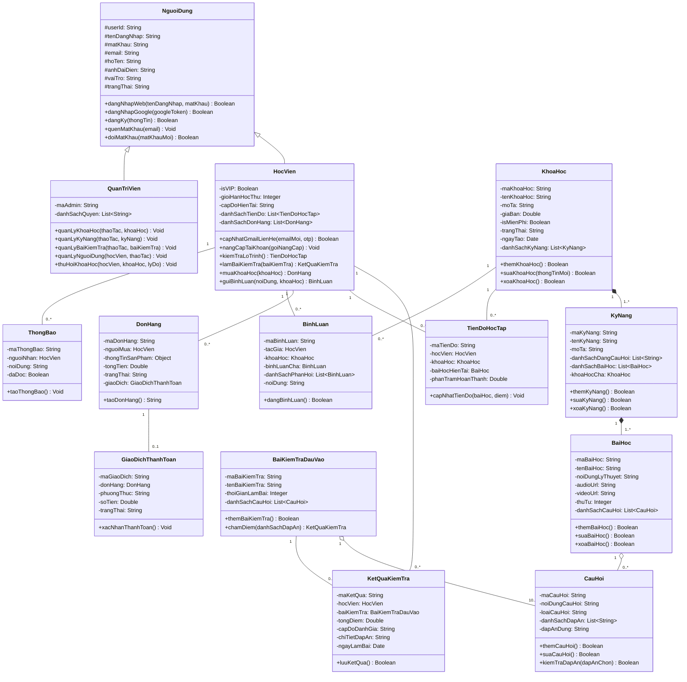

```mermaid
classDiagram
    class NguoiDung {
        #userId: String
        #tenDangNhap: String
        #matKhau: String
        #email: String
        #hoTen: String
        #anhDaiDien: String
        #vaiTro: String
        #trangThai: String
        +dangNhapWeb(tenDangNhap, matKhau) Boolean
        +dangNhapGoogle(googleToken) Boolean
        +dangKy(thongTin) Boolean
        +quenMatKhau(email) Void
        +doiMatKhau(matKhauMoi) Boolean
    }

    class HocVien {
        -isVIP: Boolean
        -gioiHanHocThu: Integer
        -capDoHienTai: String
        -danhSachTienDo: List~TienDoHocTap~
        -danhSachDonHang: List~DonHang~
        +capNhatGmailLienHe(emailMoi, otp) Boolean
        +nangCapTaiKhoan(goiNangCap) Void
        +kiemTraLoTrinh() TienDoHocTap
        +lamBaiKiemTra(baiKiemTra) KetQuaKiemTra
        +muaKhoaHoc(khoaHoc) DonHang
        +guiBinhLuan(noiDung, khoaHoc) BinhLuan
    }

    class QuanTriVien {
        -maAdmin: String
        -danhSachQuyen: List~String~
        +quanLyKhoaHoc(thaoTac, khoaHoc) Void
        +quanLyKyNang(thaoTac, kyNang) Void
        +quanLyBaiKiemTra(thaoTac, baiKiemTra) Void
        +quanLyNguoiDung(hocVien, thaoTac) Void
        +thuHoiKhoaHoc(hocVien, khoaHoc, lyDo) Void
    }

    class KhoaHoc {
        -maKhoaHoc: String
        -tenKhoaHoc: String
        -moTa: String
        -giaBan: Double
        -isMienPhi: Boolean
        -trangThai: String
        -ngayTao: Date
        -danhSachKyNang: List~KyNang~
        +themKhoaHoc() Boolean
        +suaKhoaHoc(thongTinMoi) Boolean
        +xoaKhoaHoc() Boolean
    }

    class KyNang {
        -maKyNang: String
        -tenKyNang: String
        -moTa: String
        -danhSachDangCauHoi: List~String~
        -danhSachBaiHoc: List~BaiHoc~
        -khoaHocCha: KhoaHoc
        +themKyNang() Boolean
        +suaKyNang() Boolean
        +xoaKyNang() Boolean
    }

    class BaiHoc {
        -maBaiHoc: String
        -tenBaiHoc: String
        -noiDungLyThuyet: String
        -audioUrl: String
        -videoUrl: String
        -thuTu: Integer
        -danhSachCauHoi: List~CauHoi~
        +themBaiHoc() Boolean
        +suaBaiHoc() Boolean
        +xoaBaiHoc() Boolean
    }

    class CauHoi {
        -maCauHoi: String
        -noiDungCauHoi: String
        -loaiCauHoi: String
        -danhSachDapAn: List~String~
        -dapAnDung: String
        +themCauHoi() Boolean
        +suaCauHoi() Boolean
        +kiemTraDapAn(dapAnChon) Boolean
    }

    class BaiKiemTraDauVao {
        -maBaiKiemTra: String
        -tenBaiKiemTra: String
        -thoiGianLamBai: Integer
        -danhSachCauHoi: List~CauHoi~
        +themBaiKiemTra() Boolean
        +chamDiem(danhSachDapAn) KetQuaKiemTra
    }

    class KetQuaKiemTra {
        -maKetQua: String
        -hocVien: HocVien
        -baiKiemTra: BaiKiemTraDauVao
        -tongDiem: Double
        -capDoDanhGia: String
        -chiTietDapAn: String
        -ngayLamBai: Date
        +luuKetQua() Boolean
    }

    class TienDoHocTap {
        -maTienDo: String
        -hocVien: HocVien
        -khoaHoc: KhoaHoc
        -baiHocHienTai: BaiHoc
        -phanTramHoanThanh: Double
        +capNhatTienDo(baiHoc, diem) Void
    }

    class DonHang {
        -maDonHang: String
        -nguoiMua: HocVien
        -thongTinSanPham: Object
        -tongTien: Double
        -trangThai: String
        -giaoDich: GiaoDichThanhToan
        +taoDonHang() String
    }

    class GiaoDichThanhToan {
        -maGiaoDich: String
        -donHang: DonHang
        -phuongThuc: String
        -soTien: Double
        -trangThai: String
        +xacNhanThanhToan() Void
    }

    class BinhLuan {
        -maBinhLuan: String
        -tacGia: HocVien
        -khoaHoc: KhoaHoc
        -binhLuanCha: BinhLuan
        -danhSachPhanHoi: List~BinhLuan~
        -noiDung: String
        +dangBinhLuan() Boolean
    }

    class ThongBao {
        -maThongBao: String
        -nguoiNhan: HocVien
        -noiDung: String
        -daDoc: Boolean
        +taoThongBao() Void
    }

    NguoiDung <|-- HocVien
    NguoiDung <|-- QuanTriVien

    KhoaHoc "1" *-- "1..*" KyNang
    KyNang "1" *-- "1..*" BaiHoc
    BaiHoc "1" o-- "0..*" CauHoi
    BaiKiemTraDauVao "1" o-- "10..*" CauHoi

    HocVien "1" -- "0..*" KetQuaKiemTra
    BaiKiemTraDauVao "1" -- "0..*" KetQuaKiemTra

    HocVien "1" -- "0..*" TienDoHocTap
    KhoaHoc "1" -- "0..*" TienDoHocTap

    HocVien "1" -- "0..*" DonHang
    DonHang "1" -- "0..1" GiaoDichThanhToan

    HocVien "1" -- "0..*" BinhLuan
    KhoaHoc "1" -- "0..*" BinhLuan

    HocVien "1" -- "0..*" ThongBao
```
